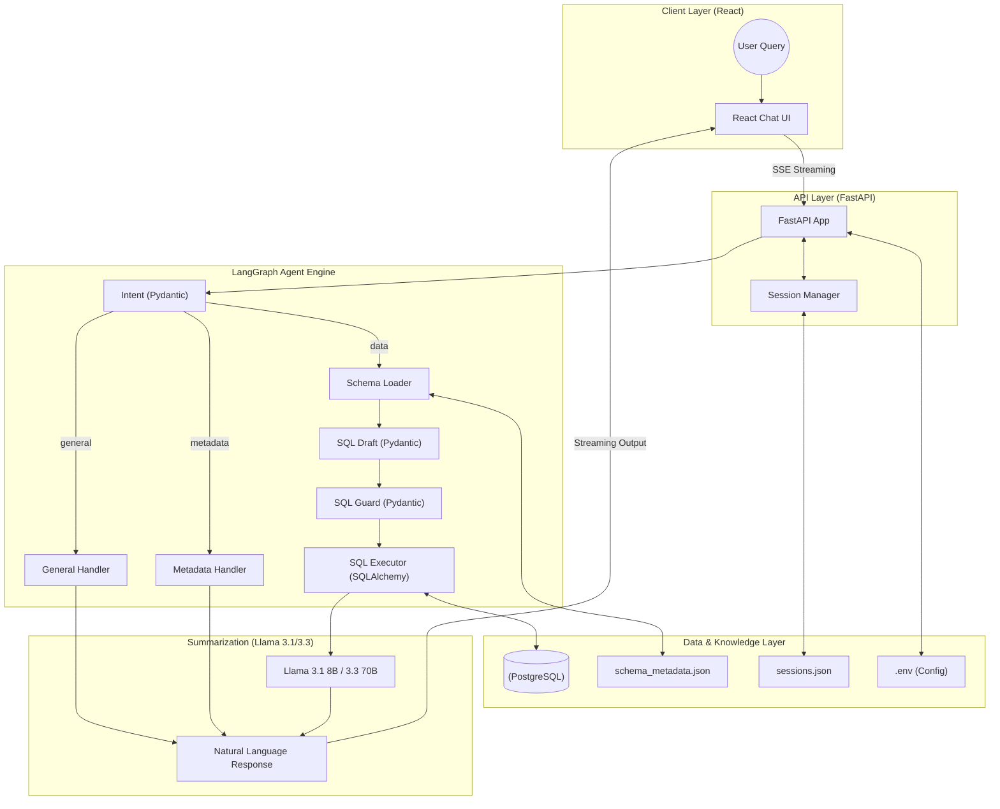

# 🏗️ End-to-End System Architecture

This diagram illustrates the complete flow of data and control in the Stateful SQL Agent project, following the architectural refactor.

### 🧱 Production Architecture Highlights

| Layer | Responsibility | Technology Stack |
| :--- | :--- | :--- |
| **Client** | Real-time UI & SSE | React, Tailwind, Vite |
| **API** | App Logic & Sessions | FastAPI, Pydantic |
| **Reasoning** | **Structured AI** | LangGraph, **Pydantic**, GPT-4o-mini |
| **Validation** | SQL Parsing & Repair | **sqlglot** |
| **Execution** | DB Connectivity | **SQLAlchemy** |
| **Summary** | Professional Responses | **Llama 3.1/3.3** |
| **Storage** | Persistence | Local JSON Files |
